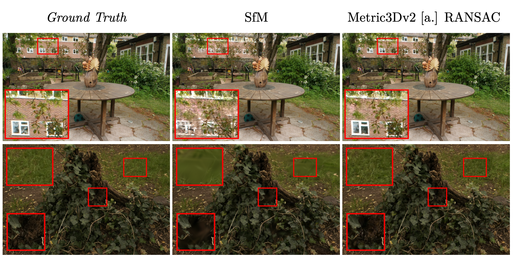

# 3DGS Initialization from Monocular Depth Predictions.

This repository contains the source code used in my master's thesis at the Faculty of Electrical Engineering of the Czech Technical University, titled "Using Monocular Depth Estimates to Improve 3D Gaussian Splatting".

*More qualitative and quantitative results are available [here](results.md), or see the thesis itself (URL coming soon™), for full detailed evaluation.*

## Setup instructions

To install all dependencies, including git submodule initialization, run the `install.sh` script located at the root of the project. The following dependencies must already be installed prior to running the script:
- `bash` to run the script
- `conda` to install dependencies
- `CUDA 12.1` to CUDA
- `GCC` will likely be required to compile some CUDA kernels. Has been tested with version `10.2`.

**NOTE**: The `nerfbaselines` integration currently only supports the `python` backend - all dependencies have to be installed in the current python environment, and `nerfbaselines` should be invoked with `--backend python`.

## Repository structure
- `gs_init_compare` - the main implementation, based on the [gsplat_examples](https://github.com/nerfstudio-project/gsplat/tree/main/examples).
    - `runner.py` - training loop implementation.
    - `trainer.py` - CLI entrypoint.
    - `config.py` - CLI arguments definition.
    - `monocular_depth_init.py` - top level monocular depth initialization functions.
    - `datasets/` - dataset handling code from gsplat examples (unused when using `nerfbaselines`).
    - `depth_alignment/` - implementation of depth alignment methods and their CLI configuration.
    - `depth_subsampling/` - implementation of depth subsampling strategies and their CLI configuration.
    - `nerfbaselines_integration/` - integration with [nerfbaselines](https://nerfbaselines.github.io/).
    - `point_cloud_postprocess/` - implementation of point cloud postprocessing (e.g. outlier removal). Not used in the thesis.
    - `third_party/` - git submodules (modified source code copy for Metric3D) for the monocular depth predictors.
    - `utils/` - did not belong to any other directory.

- `results_processing_scripts` - scripts used to process results generated by `nerfbaselines` into latex/md tables.
- `nerfbaselines_evaluator.py` - wrapper around nerfbaselines used to automate evaluation with different combinations of monocular depth predictor and settings.
- `run_viewer.sh` - utility script to run the nerfbaselines viewer for a given preset and scene.

## License Information

This software, excluding the third-party modules listed below, is distributed under the [MIT license](LICENSE).

- Several files in `gs_init_compare` are based on the [gsplat examples](https://github.com/nerfstudio-project/gsplat/tree/main/examples), which 
are distributed under the [Apache 2.0 license](LICENSE_gsplat_examples). Modifications have been made to the code in order to integrate it with 
the overall application structure, add support for monocular depth initialization, and improve integration with `nerfbaselines`.
- `gs_init_compare/lib_bilagrid.py` is distributed under the [Apache License, Version 2.0](http://www.apache.org/licenses/LICENSE-2.0).
- `gs_init_compare/third_party/metric3d` contains a slightly modified version of the metric3d repository, and is distributed under the [BSD 2-Clause License](gs_init_compare/third_party/metric3d/LICENSE). The modifications were required to fix python include issues.
- Other monocular depth predictors are not directly included and are referenced as git submodules.
- All other third-party code is consumed as packages. See package metadata for the respective licenses.
